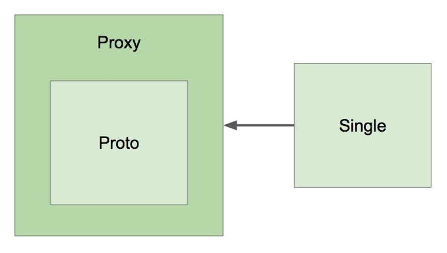

## 빈의 스코프

- 스코프
  
  - **싱글톤**(default): 빈의 **인스턴스가 한 개** 뿐
  
  - **프로토타입**(*@Scope("prototype")*): 매번 **새로운 인스턴스**를 만들어 사용
  
    - Request
    
    - Session
    
    - WebSocket
    
    - ...
    
- 프로토타입 빈이 싱글톤 빈을 참조하면?

  - 문제 없음. 프로토타입 빈 인스턴스는 매번 다르지만, 참조하는 싱글톤 빈 인스턴스는 항상 동일
  
  ```java
  @Component @Scope("prototype")
  public class Proto {
  
    @Autowired
    private Single single;
  }
  ```
  
- 싱글톤 빈이 프로토타입 빈을 참조하면?

  - 문제 발생. 프로토타입 빈의 인스턴스가 업데이트 되지 못함
  
  ```java
  @Component
  public class Single {
  
    @Autowired
    private Proto proto;
  }
  ```
  
  - 해결 방법?
  
    - scoped-proxy(*@Scope(value = "prototype", **proxyMode = ScopedProxyMode.TARGET_CLASS**)*)
    
      - 프록시 기반의 클래스로 프로토타입 빈을 감쌈
      
      - 프록시는 프로토타입 빈을 상속했기 때문에 같은 타입(의존성 주입 가능)
      
      
      
    - Object-Provider
    
    - Provider(표준)

- 싱글톤 스코프 사용시 주의할 점

  - 프로퍼티 공유(**Thread Safe X**)
  
  - ApplicationContext 초기 구동시 인스턴스 생성(시간 소요)
  
