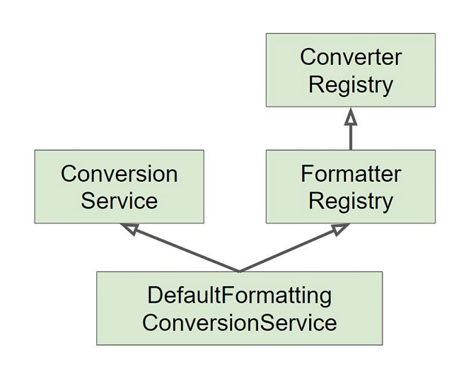

## 데이터 바인딩 추상화(2)

> PropertyEditor의 단점을 어떻게 보완할까?

## Converter

- S 타입을 T 타입으로 변환 할 수 있는 매우 일반적인 변환기

- 상태 정보 없음(stateless) => 쓰레드 세이프

- **ConverterRegistry**에 등록해서 사용

```java
public class EventConverter {

  //쓰레드 세이프하여 싱글톤 빈으로 등록해서 사용 가능
  @Component
  public static class StringtoEventConverter implements Converter<String, Event> {
    @Override
    public Event convert(String source) {
      return new Event(Integer.parseInt(source);
    }
  }
  
  @Component
  public static class EventToStringConverter implements Converter<Event, String> {
    @Override
    public String convert(Event source) {
      return source.getId().toString();
    }
  }
}
```

```java
//Spring MVC, Converter를 빈으로 등록하지 않을 때
//Spring Boot에서는 Converter를 찾아 자동으로 빈으로 등록
@Configuration
public class WebConfig implements WebMvcConfigurer {
  
  @Override
  public void addFormatters(FormatterRegistry registry) {
    //ConversionService에 등록하여 실제 변환 작업
    //ConverterRegistry를 FormatterRegistry가 상속받아 FormatterRegistry에 Converter도 추가 가능
    registry.addConverter(new EventConverter.StringToEventConverter());
  }
}
```

## Formatter(권장)

- PropertyEditor의 대체제

- Object와 String 간의 변환을 담당

- 문자열을 Locale에 따라 다국화하는 기능도 제공(optional)

- **FormatterRegistry**에 등록해서 사용

```java
//쓰레드 세이프하여 싱글톤 빈으로 등록해서 사용 가능
@Component
public class EventFormatter implements Formatter<Event> {

  @Autowired
  MessageSource messageSource;

  @Override
  public Event parse(String text, Locale locale) throws ParseException {
    return new Event(Integer.parseInt(text));
  }
  
  @Override
  public String print(Event object, Locale locale) {
    messageSource.getMessage("title", locale);
    return object.getId().toString();
  }
}
```

```java
//Spring MVC, Formatter를 빈으로 등록하지 않을 때
//Spring Boot에서는 Formatter를 찾아 자동으로 빈으로 등록
@Configuration
public class WebConfig implements WebMvcConfigurer {
  
  @Override
  public void addFormatters(FormatterRegistry registry) {
    //ConversionService에 등록하여 실제 변환 작업
    registry.addFormatter(new EventFormatter());
  }
}
```
## ConversionService

- 실제 변환 작업은 이 인터페이스를 통해 쓰레드 세이프하게

- PropertyEditor의 **DataBinder과 대응 관계**

- **스프링 MVC**, 빈 (value) 설정 파일, SpEL 등에서 **문자열을 변환**하기 위해 사용

- DefaultFormattingConversionService(구현체)

  - FormatterRegistry extends ConverterRegistry
  
  - ConversionService
  
  - 여러 기본 Converter와 Formatter 등록
  
  - System.out.println(conversionService)로 등록된 Converter, Formatter 확인 가능
  
  
  
- 스프링 부트

  - 웹 어플리케이션인 경우 DefaultFormattingConversionService를 상속해서 만든 **WebConversionService**를 빈을 등록
  
  - **Formatter와 Converter 빈을 찾아 자동으로 등록**
  
```java
@RunWith(SpringRunner.class)
//필요한 빈들만 명시적으로 등록해서 테스트하기 위해
@WebMvcText({
  EventConverter.StringToEventConverter.class,
  EventController.class})
public class EventControllerTest {

}
```
