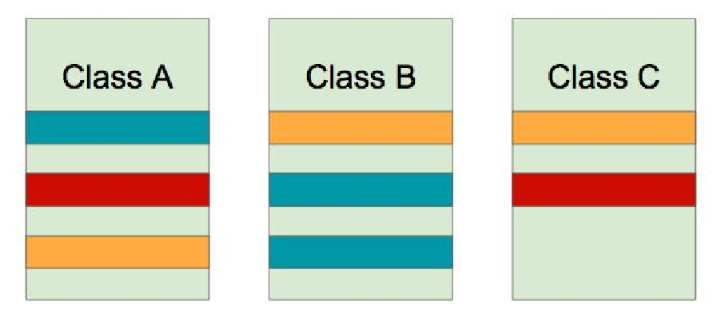
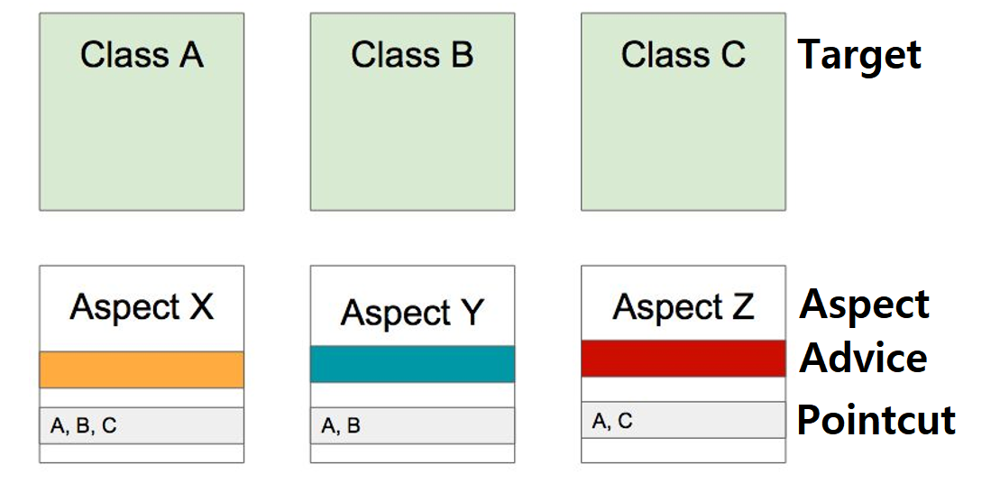

## 스프링 AOP(Aspect Oriented Programming)

> OOP를 보완하는 수단으로, 흩어진 Aspect를 모듈화 할 수 있는 프로그래밍 기법

- 흩어진 관심사(Crosscutting Concerns)

  - Concern 코드 변경시 모든 클래스 손 봐야(**유지보수 어려움**)
  

- AOP를 적용하면?

- AOP 주요 개념

  - Aspect(각각의 모듈)와 Target(적용 대상)
  
  - Advice(해야할 일)
  
  - Join point(가능한 Advice의 적용 지점)와 Pointcut(실제 적용 위치, Join point의 부분집합)
  
- AOP 구현체(자바)
  
  - AspectJ
    
  - **스프링 AOP**
    
- AOP 적용(위빙) 방법

  - 컴파일 타임 by AspectJ: A.java---(AOP)--->A.class
  
    - 로딩 타임이나 런 타임에 성능적 부하 X, but 별도의 컴파일 과정 필요
  
  - 클래스 로딩 타임 by AspectJ: A.java-->A.class---(AOP)--->메모리
  
    - 다양한 문법 사용 가능 but 로드 타임 위버 설정 필요
  
  - 런 타임 by 스프링 AOP: 클래스에 빈을 만들 때 **프록시 빈** 활용
  
    - 별다른 설정 필요 X, 다양한 문법 사용 가능 but 최초 빈 생성 시 약간의 성능적 부하
